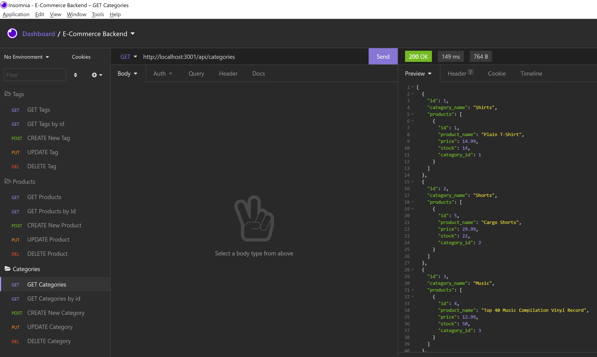

# E-Commerce-Back-End 

## Overview

E-Commerce Backend System is a commandline application to manage a company's product database. This application is built using JavaScript, Express.js, and Sequelize as the ORM to interact with MySQL.

## User Story
```
AS A manager at an internet retail company
I WANT a back end for my e-commerce website that uses the latest technologies
SO THAT my company can compete with other e-commerce companies

```
## Acceptance Criteria
```
GIVEN a functional Express.js API
WHEN I add my database name, MySQL username, and MySQL password to an environment variable file
THEN I am able to connect to a database using Sequelize
WHEN I enter schema and seed commands
THEN a development database is created and is seeded with test data
WHEN I enter the command to invoke the application
THEN my server is started and the Sequelize models are synced to the MySQL database
WHEN I open API GET routes in Insomnia Core for categories, products, or tags
THEN the data for each of these routes is displayed in a formatted JSON
WHEN I test API POST, PUT, and DELETE routes in Insomnia Core
THEN I am able to successfully create, update, and delete data in my database

```

## Table of Contents

- [Overview](#overview)
- [User Story](#user-story)
- [Acceptance Criteria](#acceptance-criteria)
- [Installation](#installation)
- [Usage](#usage)
- [Screenshots](#screenshots)
- [Questions](#questions)
- [License](#license)
- [Walkthrough video](#walkthrough-video)

    ## Installation
   - Fork repository.
   - Should have access to Visual Studio and MySql
   - Run npm install to install packages/dependencies (Express, mysql2, sequelize).
   - Install Insomnia core to test the APIs
   
    ## Usage
    Launch the command line terminal from the root directory by running the command node server.js. This will get the server running and the connection to a development database is turned on. Data is seeded and ready to be tested. The api end points can be tested on Insomnia core as shown in the walkthrough video below.
   
    ## Screenshots
    

    ## Questions
    For any questions regarding the project please visit my 
    GitHub Profile @ 
    [chaitra-srinivas](https://github.com/dfdfgfd)
    or you can reach me @ cmurthy.dev@gmail.com
    
    ## License
    [MIT](https://opensource.org/licenses/MIT)
    This application is convered under the MIT License.
    

    ## [Walkthrough video](https://drive.google.com/file/d/1VekP3HOarsdL135u5UL5HZomkRtaCib9/view?usp=sharing)


    Copyright © 2021 Chaitra Srinivasamurthy 
    